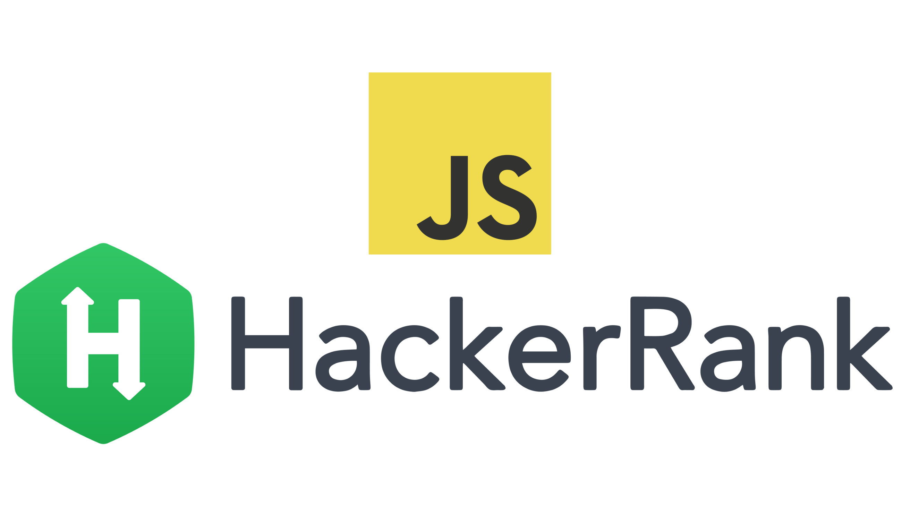

  

<h1 align="center">
  HackerRank Algorithms Javascript
</h1>

    
</a>

  This repository contains solutions to the <strong>Hackerrank</strong> practice algorithms, using <strong>Javascript</strong>.
   
   
  Take a look, play and have fun with this.
   
    <a href="https://github.com/modavidc/hackerrank-algorithms-javascript/stargazers">Stars are welcome</a>
  ·
  <a href="https://github.com/modavidc/hackerrank-algorithms-javascript/issues">Report a bug</a>
  ·
  <a href="https://github.com/modavidc/hackerrank-algorithms-javascript/issues">Request a feature</a>

## 💪 Exercices

|          Subdomain          |                                                          Challenge                                                           | Score  | Difficulty |                                             Solution                                              |
|:---------------------------:|:----------------------------------------------------------------------------------------------------------------------------:|:------:|:----------:|:-------------------------------------------------------------------------------------------------:|
|        Warmup               | [Solve Me First](https://www.hackerrank.com/challenges/solve-me-first)                                                       |   1    |    Easy    | [solution.js](warmup/solve-me-first.js)                                                           |

## 👤 Author

**Moisés Cedeño**

- Email: [moisesdavidaaron@gmail.com](mailto:moisesdavidaaron@gmail.com)
- Github: [@modavidc](https://github.com/modavidc)

## 🤝 Contributing

Contributions, issues and feature requests are welcome. 
Feel free to check [issues page](https://github.com/modavidc/hackerrank-algorithms-javascript/issues) if you want to contribute. 

## 📝 License

Copyright © 2022 [Moisés Cedeño](https://github.com/modavidc). 
This project is [MIT](https://github.com/kefranabg/readme-md-generator/blob/master/LICENSE) licensed.

---

_This README was generated with ❤️ by [readme-md-generator](https://github.com/kefranabg/readme-md-generator)_

